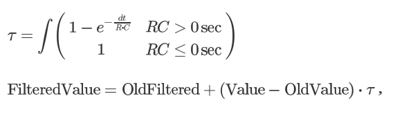
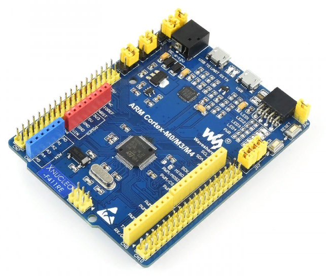
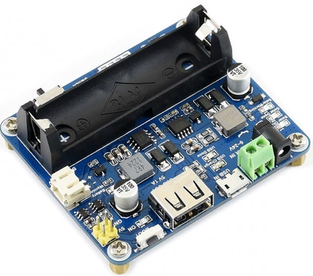
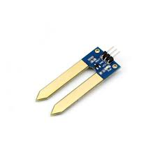
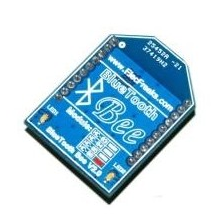
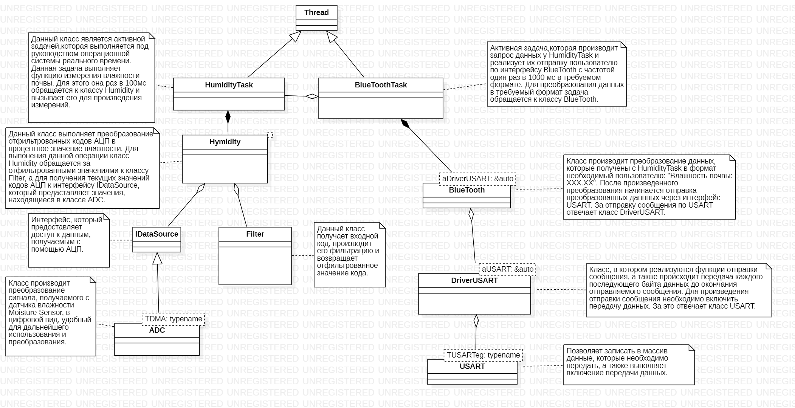

:figure-caption: Рисунок
:toc:
:toc-title: Оглавление
= Анализ требований к разработке

== Тема работы: _Разработка устройства измерения влажности почвы_
=== _Выполнили студенты группы КЭ-413: Макаров А.А., Мотов Г.А._
== *Задание к курсовой работы:* +

Для работы использовать отладочную плату _XNUCLEO-F411RE_. +

Питание платы должно быть автономным и подаваться с солнечный батарей. +

Устройство должно измерять влажность почвы:

* Для измерения должен использоваться встроенный АЦП микроконтроллера STM32F411.
* Период измерения должен составлять 100 мс.
* Для получения кодов АЦП должен использоваться механизм DMA.
* Для измерения влажности использовать датчик влажности почвы _Moisture Sensor_.
* Погрешность измерения влажности почвы не должна превышать 5% в диапазоне от 0 до 60%.
* К измеренному значению должен быть применен цифровой фильтр.

.Формула цифрового фильтра.
[#img-sunset]
[link=https://github.com/MakarovSasha/Labs/blob/main/Curs]

где _dt_ - 100 мс;

_Value_ - текущее нефильтрованное измеренное значение влажности;

_oldValue_ - предыдущее фильрованное значение;

Передача значений по беспроводному интерфейсу должна осуществляться через модуль _BlueTooth Bee HC-06_
или _I/O Expansion Shield_.

* Для этого общение с платой должно осуществляться через USART2.

* Данные должны выводиться в формате: _"Влажность почвы:" ХХХ.ХХ_ [Units].

Архитектура программы представленна в видее UML диаграмм в пакете StarUML.

Приложение должно быть написано на языке С+ с использованием компилятора ARM 8.40.2.

При разработке должна использоваться Операционная Система Реального Времени FreeRTOS и С++ обертка над ней.

= Анализ требований к разработке

== Для разработки должна использоваться отладочная плата XNUCLEO-F411RE

NUCLEO-F411RE – это отладочная плата от компании Waveshare с поддержкой Arduino, которая позволит изучить возможности микроконтроллера STM32F411RET6 на базе ядра Cortex-M3.

.Платы XNUCLEO-F411RE.
[#img-sunset]
[link=https://github.com/MakarovSasha/Labs/blob/main/Curs]

Для разработки будет использоваться отладочная плата XNUCLEO-F411RE, производства Waveshare Electronics. +
В основе платы – ARM Cortex-M4 микроконтроллер STM32F411RET6. Эта отладочная плата представляет собой гибкую платформу, позволяющую разработчикам реализовать собственные идеи и в кратчайшие сроки сделать прототип будущего изделия. +
Разъемы ST Morpho платы XNUCLEO-F411RE обеспечивают полный доступ к линиям портов ввода/вывода (I/O) и дальнейшее периферийное расширение. Изделие поставляется с отдельным модулем ST-Link/ V2.

Технические характеристики микроконтроллера STM32F411RET6:

*	ядро: ARM 32-Бит Cortex-M4;
*	рабочая частота: 100МГц;
*	рабочее напряжение: 1.7…3.6В;
*	память: 512кБ Flash, 128кБ SRAM;
*	интерфейсы: 1 x SDIO, 1 x USB 2.0 FS, 5 x SPI or 5 x I2S, 3 x USART, 3 x I2C;
*	АЦП/ЦАП: 1 x АЦП (12 Бит, 16 каналов).

Остальные технические характеристики:

*	SPX3819M5: регулятор напряжения 3,3 В;
*	AMS1117-5.0: регулятор напряжения 5,0 В;
*	CP2102: преобразователь USB в UART;
*	разъем Arduino: для подключения щитов Arduino;
*	интерфейс ICSP: Arduino ICSP;
*	USB TO UART: для отладки;
*	разъем USB: интерфейс связи USB;
*	интерфейс SWD: для программирования и отладки;
*	заголовки ST Morpho: доступ к VCC, GND и всем входам / выходам, прост в расширении;
*	6-12 В постоянного тока;
*	пользовательская кнопка;
*	кнопка сброса;
*	индикатор питания;
*	пользовательский светодиод;
*	500 мА быстрый самовосстанавливающийся предохранитель;
*	индикатор Rx / Tx последовательного порта;
*	кристалл 8 МГц;
*	кристалл 32,768 кГц.

== Питание платы должно быть автономным и подаваться с солнечный батарей

Питание будет подаваться с модуля управления солнечной энергией, для панели солнечных батарей 6V~24V.
Этот модуль управления солнечной энергией может заряжать аккумуляторную литиевую батарею 3.7 V через солнечную панель или USB-соединение и обеспечивает регулируемый выход 5V/1A.

.Модуль управления солнечной энергией.
[#img-sunset]
[link=https://github.com/MakarovSasha/Labs/blob/main/Curs]

Характеристики:

* Напряжение солнечной панели (SOLAR IN): 6V ~ 24V;
* Зарядные устройства: Солнечная панель, адаптер питания, USB;
* USB-интерфейс зарядки: Micro USB: 5V/1A;
* Внутренняя литий-батарея: 3.7 V 14500 Li-battery;
* Входное напряжение USB: 5V (интерфейс Micro USB);
* Выход 5V: 5V / 1A (USB OUT, GPIO);
* Защита от напряжения отключения заряда: 4.2 V ± 1％;
* Напряжение защиты от перегрузки: 2.9V ± 1％;
* Эффективность заряда солнечной панели: 78%;
* Эффективность зарядки USB: 82%;
* Максимальный ток покоя: <2мА;
* Рабочая температура: -40℃ ~ 85℃.

== Датчик влажности Moisture Sensor

Для измерения влажности почвы в работе используетcя датчик влажности _Moisture Sensor_ производителя WaveShare.

.Датчик влажности Moisture Sensor.
[#img-sunset]
[link=https://github.com/MakarovSasha/Labs/blob/main/Curs]

Датчик влажности сконструирован в виде «вилки», что позволяет легко его вставлять в почву. Выходное напряжение повышается наряду с увеличением уровня влажности. Датчики этого типа широко применяются в автоматических системах полива и системах обнаружения влаги.

Характеристики:

* Глубина обнаружения: 38мм;

* Напряжение питания: 2В-5В;

* Монтажные отверстия: 2мм;

* Размеры: 20 х 51мм.

==  _BlueTooth_ модуль

Передача данных осуществляется с помощью модуля _BlueTooth Bee V2.0_ производителя _ElecFreaks_.
Данный беспроводной модуль  обеспечивает
простой интерфейс для подключения к различным приложениям микроконтроллеров.
Модуль предоставляет способ беспроводного подключения к ПК или телефону для
передачи/приема встроенных данных, таких как
данные GPS, показания напряжения АЦП и другие параметры.

.Модуль Bluetooth Bee Slave.
[#img-sunset]
[link=https://github.com/MakarovSasha/Labs/blob/main/Curs]

* Напряжение питания может составлять от 3,6 до 6 В постоянного тока.
* Модуль легко подключается к любому стандартному устройству Bluetooth, необходимо найти
и ввести код доступа "1234".
* Скорость передачи данных составляет 38400 бит/с.
* Модуль не требует дополнительной настройки.

== UML-диаграммы

_Унифицированный язык моделирования (Unified Modeling Language, UML)_ является графическим языком для визуализации, специфицирования, конструирования и документирования систем, в которых большая роль принадлежит программному обеспечению.

С помощью _UML_ можно детально описать систему, начиная разработку с концептуальной модели с ее бизнес - функциями и процессами, а также описать особенности реализации системы, такие как классы программного обеспечения системы, схему базы
данных.

Нотация обеспечивает семантику языка, является способом унификации обозначений визуального моделирования, обеспечивает всестороннее представление системы, которое сравнительно легко и свободно воспринимается человеком.

Моделирование с помощью _UML_ осуществляется поэтапным построением ряда диаграмм, каждая из которых отражает какую-то часть или сторону системы либо ее замысла.

Диаграмма – это графическое представление множества элементов. Обычно диаграмма изображается в виде графа с вершинами (сущностями) и ребрами (отношениями).
Диаграммы подчиняются нотации _UML_ и изображаются в соответствии с ней.

.Архитектура устройства для измерения влажности почвы построенная в StarUML.
[#img-sunset]
[link=https://github.com/MakarovSasha/Labs/blob/main/Curs]

Основные диаграммы _UML_:

* вариантов использования (use case diagram);
* классов (class diagram);
* кооперации (collaboration diagram);
* последовательности (sequence diagram);
* состояний (statechart diagram);
* деятельности (activity diagram);
* компонентов (component diagram);
* развертывания (deployment diagram).